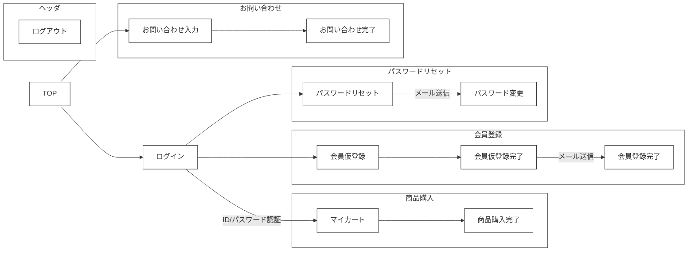
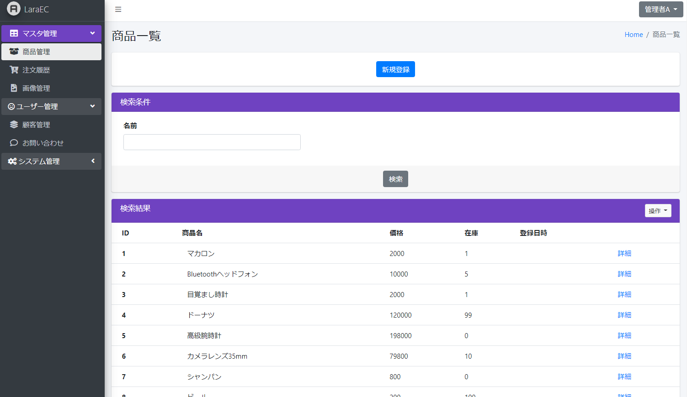
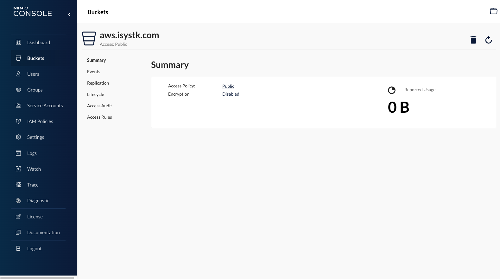

# 🌙 java-springboot-boilerplate

[](https://circleci.com/gh/circleci/circleci-docs)


## 📗 プロジェクトの概要

SpringBoot ＆ React.js の学習用サンプルアプリケーションです。
本プロジェクトは、[こちら](https://github.com/isystk/laravel-react-boilerplate)で作成した「laravel-react-boilerplate」をJavaでリメイクしたものになります。

### 対象としている方
- SpringBootを初めて学習してみたい方
- Dockerを利用したSpringBootの開発環境を構築したい方
- フロントだけでなく管理画面も作成して統合的なサンプルを作成したい方
- オブジェクトストレージへの画像アップロードを作成してみたい方
- フロントエンドをReact.jsで作成してみたい方
- Stripeを利用した決算処理を作成してみたい方
- ソーシャルログインを作成してみたい方

### 利用している技術

#### ■ インフラ
- Nginx　・・・　WebサーバーとしてNginxを採用しました。自己証明書を設定済みなので開発環境でSSLとして動作可能です。
- MySQL　・・・　DBサーバーにはMySQLを採用しました。データファイルや設定ファイル、 ログなどはコンテナの外に出して 開発時に参照出来るようにしています。
- phpMyAdmin　・・・　起動したMySQLのデータを参照・編集するためのツールです。
- MailHog 　・・・　ダミーのSMTPサーバーです。送信したメールをブラウザで閲覧することが可能です。実際にはメールは送信されないので開発時の誤送信してしまう心配がありません。
- Minio 　・・・　S3に完全互換性のあるオブジェクトストレージです。アップロードした画像の保存先として利用しています。
- Redis 　・・・　永続化可能なインメモリデータベースです。DBから取得したデータのキャッシュとして利用しています。
- Solr 　・・・　検索サーバーです。事前にバッチを実行してDBの値をSolrにインデックスしておくことでWeb検索時の速度アップや負荷軽減が期待できます。

#### ■ アプリケーション

- SpringBoot 2.5
- React 18
- Typescript
- Bootstrap 4
- Adminlte 3

## 🌐 Demo

#### ■ フロント画面(React)


- ログイン/ログアウト
- 会員登録
- パスワードリマインダ
- 商品一覧
- カートに追加
- 決算処理(Stripe)
- お気に入り追加
- お問い合わせ
- ソーシャルログイン(Google)




#### ■ 管理画面(Bootstrap)



- ログイン/ログアウト
- 商品管理
- 注文履歴
- 顧客管理
- お問い合わせ管理
- 画像管理
- CSVダウンロード
- PDFダウンロード
- 画像アップロード 

#### ■ バッチ処理

- Solrインデックス生成バッチ
- CSV商品データ/画像取り込みバッチ

## 💬 インストール

※ この環境を利用する為には、事前にdocker、docker-composeが動作する状態であることが前提条件です。
(Windowsの場合は、以下を参考に「WSL」と「Docker Desktop for Windows」を用意してください)

### WSLのインストール(Windowsの場合)
参考
https://docs.microsoft.com/ja-jp/windows/wsl/install

WSLでUbuntuを起動する
```
# 初回起動時に、ユーザ名とパスワードが聞かれます。
# 何も入力せずにEnterを押すとroot ユーザーで利用できるようになるので、rootユーザーとして設定します。
# 初めにライブラリを最新化します。
$ apt update
# 日本語に対応しておきます。
$ apt -y install language-pack-ja
$ update-locale LANG=ja_JP.UTF8
$ apt -y install manpages-ja manpages-ja-dev
```

### Docker Desktop for Windows のインストール(Windowsの場合)

https://docs.docker.com/docker-for-windows/install/
```
↓コマンドプロンプトでバージョンが表示されればOK
docker --version
```

### WSL2から、Docker for Windows を利用できるようにする(Windowsの場合)
参考
https://qiita.com/endo_hizumi/items/0cc50bdfbd827579733e
```
１．通知領域から、dockerのアイコンを右クリックして、Settingを選択
２．Generalのexpose deamon on~~のチェックを入れます。
３．ResourcesのWSL INTEGRATION から、"Ubuntu" をスイッチをONにします。
WSL 側のルートを Docker for Windows に合わせるように WSL のマウント設定を行います。
$ vi /etc/wsl.conf
---
[automount]
root = /
options = "metadata"
---
以下のように Cドライブのパスが"/mnt/c/"→"/c/" に変更されていれば正常です。
$ cd /c/Users/USER/github
$ pwd
/c/Users/USER/github
# WSL 上にDockerとDocker Composeをインストールする。
$ apt install docker
$ apt install docker-compose
これでWSLで起動したDockerコンテナがホストマシン側で利用できるようになります。
```

### ソースコードをダウンロードする

github からソースコードをダウンロードします。 Windows の場合はWSL側ではなく、必ずWindows側のディレクトリに配置してください。
WSL側でSpringbootを起動した場合はホスト側のブラウザからアクセスが出来なくなってしまいます。
```
# ソースコードを配置したいディレクトリに移動する
cd /root/github
# Githubからソースコードをダウンロードする
git clone git@github.com:isystk/java-springboot-boilerplate.git
```

### MySQL Client のインストール

```
# MySQLに接続する為のコマンドをインストールします。(バージョンは何でもOK)
# Windowsの場合
$ apt install mysql-client
# Macの場合
$ brew install mysql-client
```

### Node.js のインストール

```
# Windowsの場合
$ curl -L git.io/nodebrew | perl - setup
# Macの場合
$ brew install nodebrew
# nodebrew をシェルのパスに追加する
$ echo 'export PATH=$HOME/.nodebrew/current/bin:$PATH' >> ~/.bashrc
# Node.js をインストール 
$ mkdir -p ~/.nodebrew/src
$ nodebrew ls-remote
$ nodebrew install v16.13.1
$ nodebrew use v16.13.1
$ npm install -g yarn
```

## 📦 ディレクトリ構造
```
.
├── docker
│   ├── mysql (DBサーバー)
│   │   ├── conf.d (mysqlの設定ファイル)
│   │   └─── logs (mysqlのログ)
│   ├── nginx (Webサーバー)
│   │   ├── conf.d (nginxの設定ファイル)
│   │   ├── logs (nginxのログ)
│   │   └── ssl (SSL自己証明書)
│   ├── phpmyadmin (DB管理コンソール)
│   ├── s3 (Minio)
│   ├── solr (検索エンジン)
│   │   ├── data (solrのデータファイル)
│   │   └── logs (solrのログ)
│   └── docker-compose.yml
├── batch (バッチ)
│   └── src
│       └── main
│           ├── java
│           └── resources
├── business (共通ロジック)
│   └── src
│       └── main
│           ├── java
│           └── resources
│               ├── doma-gen (doma2のジェネレータ)
│               └── sample.a5er (ER図)
├── htdocs
│   └── thumb (アップロード画像の一時保存)
├── web (Web共通ロジック)
│   └── src
│       └── main
│           ├── java
│           └── resources
├── web-admin (管理画面)
│   └── src
│       └── main
│           ├── java
│           └── resources
├── web-front (フロント画面)
│   ├── src
│   │   └── main
│   │       ├── java
│   │       └── resources
│   └── resources (フロントエンドモジュール)
│       ├── node_modules
│       ├── package.json
│       ├── public
│       ├── src
│       │   ├── @types
│       │   ├── __test__
│       │   ├── auth
│       │   ├── components
│       │   ├── constants
│       │   ├── index.tsx
│       │   ├── pages
│       │   ├── react-app-env.d.ts
│       │   ├── reportWebVitals.ts
│       │   ├── router.tsx
│       │   ├── services
│       │   ├── setupTests.ts
│       │   ├── static
│       │   ├── stores
│       │   ├── stories
│       │   ├── styles
│       │   └── utilities
│       ├── tsconfig.json
│       └── yarn.lock
├── dc.sh (Docker操作用スクリプト)
└── build.gradle (Gradle用設定ファイル)
```

### IntelliJ IDEAのインストール

以下のURLから、IntelliJ IDEA をダウンロードしてインストールを行います。無料のCommunity版で問題ありません。
https://www.jetbrains.com/ja-jp/idea/download/

```
# コードフォーマッターを設定する
「Preferences - Editor - Code Style - Java」にて、Schemeのところの設定アイコンから、"intellij-java-google-style.xml" をインポートする。

# Lombok pluginをインストールする(既にインストールされている場合は不要です)
「Preferences - Plugins - Marketplace」から、"Lombok"をインストール後、InteliJを再起動する

# Annotation Processingを有効にする
「Preferences - Build,Execution,Deployment - Compiler - Annotation Processors」から、
”Enable annotation processing” を有効にする

# デバック時のホットスワップを有効にする
「Preferences - Advanced Settings - Compiler」から、”Allow auto-make to start even if developed application is currently running” を有効にする。
```


## 🔧 開発環境の構築 

各種デーモンを起動する
```bash
# 初期化
$ ./dc.sh init
# すべてのDockerコンテナを起動する
$ ./dc.sh start
# データベースが立ち上がるまで少し待ちます。(初回は5分程度)
# データベースが起動したら、MySQLにログインしてみる
$ ./dc.sh mysql login
```

Minio にS3バケットを作成する

http://localhost:9001

画像ファイルなどを保存する為のバケットを
「aws.isystk.com」 という名前で作成して、
HTMLから参照できるように Publicにしておきます。




バックエンド環境を構築する
```bash
# Gradleで利用できるタスクの一覧を確認します。
$ ./gradlew tasks

# Flywayでベースライン作成とマイグレードを実行します。
$ ./gradlew business::flywayMigrate
$ ./gradlew business::flywayInfo

# (既存のSQLを修正するなどして整合性エラーになる場合は以下を実施してください。) 
$ ./gradlew business::flywayRepair
# (すべてのオブジェクトを削除して初期化したい場合は以下を実施してください。)
$ ./gradlew business::flywayClean

# バッチを実行して商品マスタデータを登録する
# ※ Windowsの場合はWSLからコマンド実行ではなくInteliJ側のGradleから起動しないと正常に動作しないので注意してください。
$ ./gradlew batch::bootRun -Pargs=--job=importMstJob

# 管理画面側のアプリケーションを起動します。
# ※ Windowsの場合はWSLからコマンド実行ではなくInteliJ側のGradleから起動しないとブラウザからアクセスできないので注意してください。
$ ./gradlew web-admin::bootRun

# バッチを実行してSolrに商品データをインデックスする
# ※ Windowsの場合はWSLからコマンド実行ではなくInteliJ側のGradleから起動しないと正常に動作しないので注意してください。
$ ./gradlew batch::bootRun -Pargs=--job=solrRegistJob

# フロント側のアプリケーションを起動します。
# ※ Windowsの場合はWSLからコマンド実行ではなくInteliJ側のGradleから起動しないとブラウザからアクセスできないので注意してください。
$ ./gradlew web-front::bootRun
```

フロントエンド環境を構築する
```bash
# フロントエンドをビルドする。
$ cd web-front/resources 
$ yarn 
$ yarn build
```

## 🖊️ Docker 操作用シェルスクリプトの使い方

```
Usage:
  $(basename ${0}) [command] [<options>]

Options:
  stats|st                 Dockerコンテナの状態を表示します。
  init                     Dockerコンテナ・イメージ・生成ファイルの状態を初期化します。
  start                    すべてのDaemonを起動します。
  stop                     すべてのDaemonを停止します。
  nginx restart            NginXを再起動します。
  mysql login              MySQLデータベースにログインします。
  mysql export <PAHT>      MySQLデータベースのdumpファイルをエクスポートします。
  mysql import <PAHT>      MySQLデータベースにdumpファイルをインポートします。
  mysql restart            MySQLデータベースを再起動します。
  --version, -v     バージョンを表示します。
  --help, -h        ヘルプを表示します。
```

### PhpMyAdmin
MySQLデータベースに接続してデータの参照や編集が可能です。<br>
Dockerを起動後に以下のURLにアクセスすると利用可能です。

http://localhost:8888/

### Mailhog
ダミーのメールサーバーです。実際にはメールは送信されず、送信されたメールはブラウザで閲覧できます。<br>
Dockerを起動後に以下のURLにアクセスすると利用可能です。

http://localhost:8025/

### Minio
S3に準拠したダミーのオブジェクトストレージです。<br>
Dockerを起動後に以下のURLにアクセスすると利用可能です。

http://localhost:9001/

| Username   | Password |
|:-----------| :----------|
| access_key | secret_key |

### Solr
Solrの管理コンソールです。インデックスされたデータを検索したり出来ます。<br>
Dockerを起動後に以下のURLにアクセスすると利用可能です。

http://localhost:8983/

### Swagger
作成したAPIの一覧を確認したりデータを検索できます。<br>
フロントを起動後に以下のURLにアクセスすると利用可能です。

http://localhost:8080/swagger-ui/

## 🔗 参考

| プロジェクト| 概要|
| :---------------------------------------| :-------------------------------|
| [Springframework](https://projects.spring.io/spring-framework/)| Spring Framework|
| [Spring Security](https://projects.spring.io/spring-security/)| セキュリティ対策、認証・認可のフレームワーク|
| [Doma2](https://doma.readthedocs.io/ja/stable/)| O/Rマッパー|
| [spring-boot-doma2](https://github.com/domaframework/doma-spring-boot)| Doma2とSpring Bootを連携する|
| [Flyway](https://flywaydb.org/)| DBマイグレーションツール|
| [Thymeleaf](http://www.thymeleaf.org/)| テンプレートエンジン|
| [Thymeleaf Layout Dialect](https://ultraq.github.io/thymeleaf-layout-dialect/)| テンプレートをレイアウト化する|
| [WebJars](https://www.webjars.org/)| jQueryなどのクライアント側ライブラリをJARとして組み込む|
| [ModelMapper](http://modelmapper.org/)| Beanマッピングライブラリ|
| [Ehcache](http://www.ehcache.org/)| キャッシュライブラリ|
| [Spock](http://spockframework.org/)| テストフレームワーク|
| [Mockito](http://site.mockito.org/)| モッキングフレームワーク |
| [AdminLTE Docs](https://adminlte.io/docs/2.4/installation)| AdminLTE Docs|
| [Bootstrap4 日本語リファレンス](https://getbootstrap.jp/docs/4.4/getting-started/introduction/)| Bootstrap4 日本語リファレンス|


## 🎫 Licence

[MIT](https://github.com/isystk/java-springboot-boilerplate/blob/master/LICENSE)

## 👀 Author

[isystk](https://github.com/isystk)
