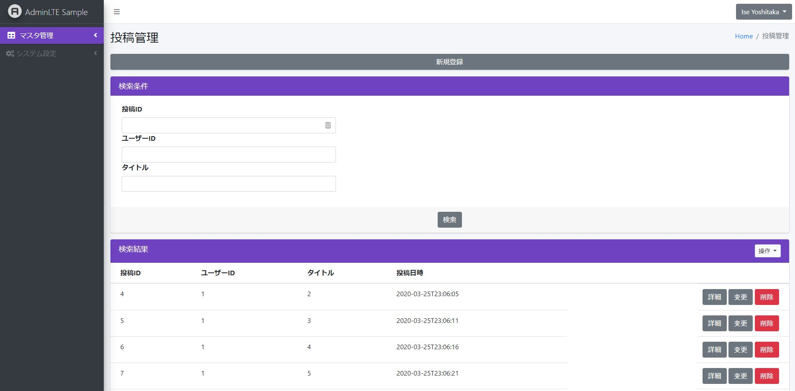
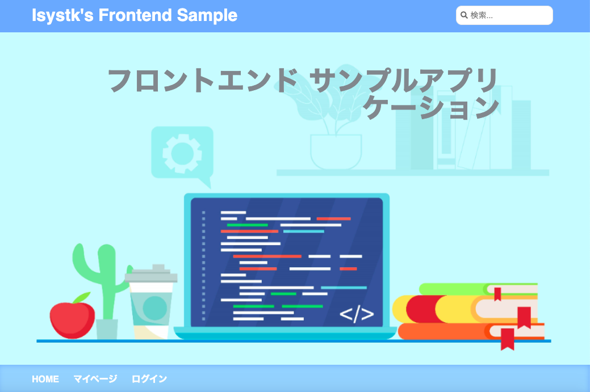
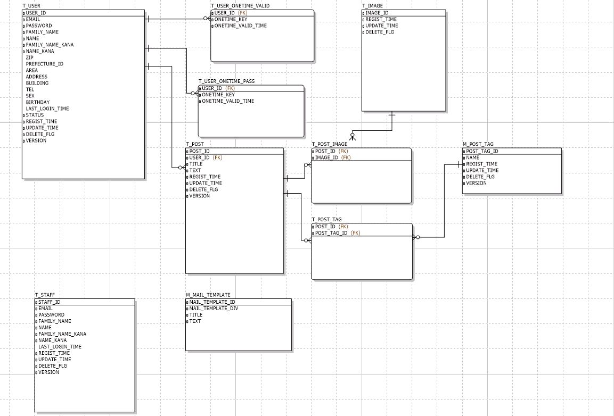

# 🌙 java-springboot-gradle

====

## 📗 Description

SpringBoot を利用したマルチモジュールのボイラープレートです。
1. 管理画面(AdminLTE、ログイン/ログアウト、一覧/詳細/登録/更新/削除、CSV/Excel/PDFダウンロード)
2. フロント画面（Vuejs、Solr検索API、ログイン/ログアウト）
3. バッチ（Solrインデックス生成、CSV読み込み/DB登録）

### ディレクトリ構造
```
.
├── docker
│   ├── mysql （DBサーバー）
│   │   ├── conf.d (mysqlの設定ファイル)
│   │   ├── data (mysqlのデータファイル)
│   │   ├── doma-gen (doma2のジェネレータ)
│   │   ├── init （mysqlの初期DDL）
│   │   ├── logs （mysqlのログ）
│   │   ├── script （mysql関連のスクリプト）
│   │   └── sample.a5er （ER図）
│   ├── nginx （Webサーバー）
│   │   ├── conf.d (nginxの設定ファイル)
│   │   ├── logs （nginxのログ）
│   │   └── ssl （SSL自己証明書）
│   ├── phpmyadmin （DB管理コンソール）
│   ├── s3（Minio）
│   │   └── data (オブジェクトストレージ)
│   ├── solr （検索エンジン）
│   │   ├── data (solrのデータファイル)
│   │   └── logs （solrのログ）
│   ├── .env
│   └── docker-compose.yml
├── batch (バッチ)
├── business (共通ロジック)
├── static (フロントエンドモジュール)
│   └── public (WEB公開ディレクトリ)
│       └── thumb （アップロードした写真）
├── web (Web共通ロジック)
├── web-admin (管理画面)
├── web-front (フロント画面)
├── dc.sh （Dockerの起動用スクリプト）
└── build.gradle （Gradle用設定ファイル）
```

## 🖊️ VS. 

### 利用している技術
- Docker
    - NginX 1.15　・・・　WebサーバーとしてNginXを採用しました。自己証明書を設定済みなので開発環境でSSLとして動作可能です。
    - MySQL 5.7　・・・　DBサーバーにはMySQLを採用しました。データファイルや設定ファイル、 ログなどはコンテナの外に出して 開発時に参照出来るようにしています。
    - Solr 8.4　・・・　フロント表示はSolrからデータ取得表示、また、バッチでDB取得したデータをインデックス生成させています。
    - phpMyAdmin　・・・　起動したMySQLのデータを参照・編集するためのツールです。
    - MailHog 　・・・　ダミーのSMTPサーバーです。送信したメールをブラウザで閲覧することが可能です。実際にはメールは送信されないので開発時の誤送信してしまう心配がありません。
    - Minio 　・・・　S3に完全互換性のあるオブジェクトストレージです。アップロードした画像の保存先として利用しています。
    - Redis 　・・・　永続化可能なインメモリデータベースです。DBから取得したデータのキャッシュとして利用しています。
- アプリケーション
    - SpringBoot 2.2.5
    - Spring Data Solr
    - Spring Batch
    - Doma2
    - AdminLTE3
    - ReactJS

## 🌐 Demo

管理画面


フロント画面.


テーブル構成.


## 🎨 Requirement

推奨するJDKのバージョン 11以上 

## 💬 Usage

#### Gradleのタスク一覧

```bash
$ ./gradlew tasks
```

#### Dockerの起動
NginX、MySQL、Solr、S3などのサーバーを立ち上げる。

```bash
$ ./gradlew composeUp
# Mysqlログイン
$ mysql -h 127.0.0.1 -P 3306 -u root -ppassword sample
```

#### Flyway ベースライン作成とマイグレード

```bash
$ ./gradlew business::flywayInfo
$ ./gradlew business::flywayBaseline 
$ ./gradlew business::flywayMigrate
$ ./gradlew business::flywayInfo
```

```bash
# 既存のSQLを修正するなどして整合性エラーになる場合は以下を実施
$ ./gradlew business::flywayRepair
$ ./gradlew business::flywayValidate
```


#### minio に S3バケットを作成する

```bash
$ export AWS_ACCESS_KEY_ID=access_key
$ export AWS_SECRET_ACCESS_KEY=secret_key
# バケットの一覧を確認する
$ aws --endpoint-url http://localhost:9090 s3 ls
# バケットを作成する
$ aws configure --profile isystk
$ aws --endpoint-url http://localhost:9090 --profile isystk s3 mb s3://www.isystk.work
# バケットを公開する
$ POLICY='{ "Version": "2012-10-17", "Statement": [{ "Sid": "MakeItPublic", "Effect": "Allow", "Principal": "*", "Action": "s3:GetObject", "Resource": "arn:aws:s3:::www.isystk.work/*" }] }'
$ aws --endpoint-url http://localhost:9090 --profile isystk s3api put-bucket-policy --bucket www.isystk.work --policy $POLICY
# テストファイルをアップロードする
$ echo 'hello' > test.txt
$ aws --endpoint-url http://localhost:9090 --profile isystk s3 cp ./test.txt s3://www.isystk.work
```

#### アプリケーションの起動

```bash
$ cd /path/to/java-springboot-gradle

# bootrun admin application
$ ./gradlew web-admin::bootRun

# bootrun front application
$ ./gradlew web-front::bootRun

$ # bootrun batch application
$ ./gradlew batch::bootRun -Pargs=--job=solrRegistJob
```

```

#### 接続先情報

##### ログインユーザー
test@sample.com / password

| 接続先| URL|
| :-----| :---------------------------------------|
| 管理側画面| https://localhost/admin/|
| フロント側| https://localhost/|
| フロントAPI| https://localhost/api/v1/post/|
| phpMyAdmin| http://localhost:8888/|
| Solr| http://localhost:8983/solr/|
| MailHog| http://localhost:8025/|
| Minio| http://localhost:9090/|

## 📦 Install

### 開発環境構築

#### ソースのダウンロード
```bash
$ git clone https://github.com/isystk/java-springboot-gradle.git
```

#### InteliJ IDEA のインストール

```bash
$ brew cask install intellij-idea-ce
```

- コードフォーマッターを設定する
「Preferences - Editor - Code Style - Java」にて、Schemeのところの設定アイコンから、"intellij-java-google-style.xml" をインポートする。

- Lombok pluginをインストールする。
「Preferences - Plugins - Marketplace」から、"Lombok"をインストール後、InteliJを再起動する

- Annotation Processingを有効にする。
「Preferences - Build,Execution,Deployment - Compiler - Annotation Processors」から、
”Enable annotation processing” を有効にする

## 🔧 Contribution

1. Fork it ( http://github.com/isystk/java-springboot-gradle/fork )
2. Create your feature branch (git checkout -b my-new-feature)
3. Commit your changes (git commit -am 'Add some feature')
4. Push to the branch (git push origin my-new-feature)
5. Create new Pull Request

## 🔗 参考

| プロジェクト| 概要|
| :---------------------------------------| :-------------------------------|
| [Lombok Project](https://projectlombok.org/)| 定型的なコードを書かなくてもよくする|
| [Springframework](https://projects.spring.io/spring-framework/)| Spring Framework|
| [Spring Security](https://projects.spring.io/spring-security/)| セキュリティ対策、認証・認可のフレームワーク|
| [Doma2](https://doma.readthedocs.io/ja/stable/)| O/Rマッパー|
| [spring-boot-doma2](https://github.com/domaframework/doma-spring-boot)| Doma2とSpring Bootを連携する|
| [Flyway](https://flywaydb.org/)| DBマイグレーションツール|
| [Thymeleaf](http://www.thymeleaf.org/)| テンプレートエンジン|
| [Thymeleaf Layout Dialect](https://ultraq.github.io/thymeleaf-layout-dialect/)| テンプレートをレイアウト化する|
| [WebJars](https://www.webjars.org/)| jQueryなどのクライアント側ライブラリをJARとして組み込む|
| [ModelMapper](http://modelmapper.org/)| Beanマッピングライブラリ|
| [Ehcache](http://www.ehcache.org/)| キャッシュライブラリ|
| [Spock](http://spockframework.org/)| テストフレームワーク|
| [Mockito](http://site.mockito.org/)| モッキングフレームワーク |
| [AdminLTE Docs](https://adminlte.io/docs/2.4/installation)| AdminLTE Docs|
| [Bootstrap4 日本語リファレンス](https://getbootstrap.jp/docs/4.4/getting-started/introduction/)| Bootstrap4 日本語リファレンス|
| [アイコン（fontawesome）](https://fontawesome.com/icons?d=gallery)| アイコン（fontawesome）|


## 🎫 Licence

[MIT](https://github.com/isystk/java-springboot-gradle/blob/master/LICENSE)

## 👀 Author

[isystk](https://github.com/isystk)


