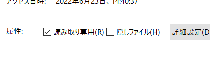

# 🌙 java-springboot-boilerplate
====

[](https://circleci.com/gh/circleci/circleci-docs)


## 📗 プロジェクトの概要

SpringBoot ＆ React.js の学習用サンプルアプリケーションです。

### 対象としている方
- SpringBootを初めて学習してみたい方
- Dockerを利用したSpringBootの開発環境を構築したい方
- フロントだけでなく管理画面も作成して統合的なサンプルを作成したい方
- オブジェクトストレージへの画像アップロードを作成してみたい方
- フロントエンドをReact.jsで作成してみたい方

### 利用している技術

#### ■ インフラ
- Nginx　・・・　WebサーバーとしてNginxを採用しました。自己証明書を設定済みなので開発環境でSSLとして動作可能です。
- MySQL　・・・　DBサーバーにはMySQLを採用しました。データファイルや設定ファイル、 ログなどはコンテナの外に出して 開発時に参照出来るようにしています。
- phpMyAdmin　・・・　起動したMySQLのデータを参照・編集するためのツールです。
- MailHog 　・・・　ダミーのSMTPサーバーです。送信したメールをブラウザで閲覧することが可能です。実際にはメールは送信されないので開発時の誤送信してしまう心配がありません。
- Minio 　・・・　S3に完全互換性のあるオブジェクトストレージです。アップロードした画像の保存先として利用しています。
- Redis 　・・・　永続化可能なインメモリデータベースです。DBから取得したデータのキャッシュとして利用しています。

#### ■ アプリケーション

- SpringBoot 2
- React 16
- Typescript
- Bootstrap 4
- Adminlte 3

## 🌐 Demo

#### ■ フロント画面（React）


- ログイン/ログアウト
- 会員登録
- 投稿一覧
- 投稿詳細
- マイページ
- 投稿登録・変更・削除

#### ■ 管理画面（Bootstrap）


- ログイン/ログアウト
- 投稿管理
- CSVダウンロード
- Excelダウンロード
- PDFダウンロード

#### ■ バッチ処理

- Solrインデックス生成バッチ
- CSV読み込み/DB登録バッチ


## 🔧 開発環境の構築

※ この環境を利用する為には、事前にdocker、docker-composeが動作する状態であることが前提条件です。
(Windowsの場合は、以下を参考に「WSL」と「Docker Desktop for Windows」を用意してください)

### WSLのインストール（Windowsの場合）
参考
https://docs.microsoft.com/ja-jp/windows/wsl/install

WSLでUbuntuを起動する
```
# 初回起動時に、ユーザ名とパスワードが聞かれます。
# 何も入力せずにEnterを押すとroot ユーザーで利用できるようになるので、rootユーザーとして設定します。
# 初めにライブラリを最新化します。
$ apt update
# 日本語に対応しておきます。
$ apt -y install language-pack-ja
$ update-locale LANG=ja_JP.UTF8
$ apt -y install manpages-ja manpages-ja-dev
```

### Docker Desktop for Windows のインストール（Windowsの場合）

https://docs.docker.com/docker-for-windows/install/
```
↓コマンドプロンプトでバージョンが表示されればOK
docker --version
```

### WSL2から、Docker for Windows を利用できるようにする（Windowsの場合）
参考
https://qiita.com/endo_hizumi/items/0cc50bdfbd827579733e
```
１．通知領域から、dockerのアイコンを右クリックして、Settingを選択
２．Generalのexpose deamon on~~のチェックを入れます。
３．ResourcesのWSL INTEGRATION から、"Ubuntu" をスイッチをONにします。
WSL 側のルートを Docker for Windows に合わせるように WSL のマウント設定を行います。
$ vi /etc/wsl.conf
---
[automount]
root = /
options = "metadata"
---
以下のように Cドライブのパスが"/mnt/c/"→"/c/" に変更されていれば正常です。
$ cd /c/Users/USER/github
$ pwd
/c/Users/USER/github
# WSL 上にDockerとDocker Composeをインストールする。
$ apt install docker
$ apt install docker-compose
これでWSLからWindows側にインストールしたDockerが利用できるようになります。
```

### ソースコードをダウンロードする

github からソースコードをダウンロードします。 Windows の場合はWSL側ではなく、必ずWindows側のディレクトリに配置してください。
WSL側でSpringbootを起動した場合はホスト側のブラウザからアクセスが出来なくなってしまいます。
```
# ソースコードを配置したいディレクトリに移動する
cd /c/Users/USER/github
# Githubからソースコードをダウンロードする
git clone git@github.com:isystk/java-springboot-boilerplate.git
```

WSL の場合は、MySQLのConfファイルがWindows側のディスクにあると権限の違いでDockerコンテナがロードできなくなるのでWindows側で読み取り専用に変更してください。



### IntelliJ IDEAのインストール

以下のURLから、IntelliJ IDEA をダウンロードしてインストールを行います。無料のCommunity版で問題ありません。
https://www.jetbrains.com/ja-jp/idea/download/

```
# コードフォーマッターを設定する
「Preferences - Editor - Code Style - Java」にて、Schemeのところの設定アイコンから、"intellij-java-google-style.xml" をインポートする。

# Lombok pluginをインストールする（既にインストールされている場合は不要です）
「Preferences - Plugins - Marketplace」から、"Lombok"をインストール後、InteliJを再起動する

# Annotation Processingを有効にする
「Preferences - Build,Execution,Deployment - Compiler - Annotation Processors」から、
”Enable annotation processing” を有効にする

# 自動ビルドを有効にする
「Compiler」にて、”Build project automatically” を有効にする
```

### MySQL Client のインストール

```
# MySQLに接続する為のコマンドをインストールします。（バージョンは何でもOK）
# Windowsの場合
$ apt install mysql-client
# Macの場合
$ brew install mysql-client
```

### Node.js のインストール

```
# Windowsの場合
$ curl -L git.io/nodebrew | perl - setup
# Macの場合
$ brew install nodebrew
# nodebrew をシェルのパスに追加する
$ echo 'export PATH=$HOME/.nodebrew/current/bin:$PATH' >> ~/.bashrc
# Node.js をインストール 
$ mkdir -p ~/.nodebrew/src
$ nodebrew ls-remote
$ nodebrew install v16.13.1
$ nodebrew use v16.13.1
$ npm install -g yarn
```

## 📦 ディレクトリ構造
```
.
├── docker
│   ├── mysql （DBサーバー）
│   │   ├── conf.d (mysqlの設定ファイル)
│   │   ├── doma-gen (doma2のジェネレータ)
│   │   ├── logs （mysqlのログ）
│   │   └── sample.a5er （ER図）
│   ├── nginx （Webサーバー）
│   │   ├── conf.d (nginxの設定ファイル)
│   │   ├── logs （nginxのログ）
│   │   └── ssl （SSL自己証明書）
│   ├── phpmyadmin （DB管理コンソール）
│   ├── s3（Minio）
│   │   └── data (オブジェクトストレージ)
│   ├── solr （検索エンジン）
│   │   ├── data (solrのデータファイル)
│   │   └── logs （solrのログ）
│   ├── .env
│   └── docker-compose.yml
├── batch (バッチ)
│   └── src
├── business (共通ロジック)
│   └── src
├── htdocs
│   └── thumb （アップロードした写真）
├── web (Web共通ロジック)
│   └── src
├── web-admin (管理画面)
│   └── src
├── web-front (フロント画面)
│   ├── src
│   └── resources (フロントエンドモジュール)
├── dc.sh （Dockerの起動用スクリプト）
└── build.gradle （Gradle用設定ファイル）
```

## 🖊️ Docker 操作用シェルスクリプトの使い方

```
Usage:
  $(basename ${0}) [command] [<options>]

Options:
  stats|st                 Dockerコンテナの状態を表示します。
  init                     Dockerコンテナ・イメージ・生成ファイルの状態を初期化します。
  start                    すべてのDaemonを起動します。
  stop                     すべてのDaemonを停止します。
  nginx restart            NginXを再起動します。
  mysql login              MySQLデータベースにログインします。
  mysql export <PAHT>      MySQLデータベースのdumpファイルをエクスポートします。
  mysql import <PAHT>      MySQLデータベースにdumpファイルをインポートします。
  mysql restart            MySQLデータベースを再起動します。
  --version, -v     バージョンを表示します。
  --help, -h        ヘルプを表示します。
```

### phpMyAdmin
データベースに接続してデータの参照や編集が可能です。
Dockerを起動後に以下のURLにアクセスすると利用可能です。

http://localhost:8888/

### mailhog
ダミーのメールサーバーです。実際にはメールは送信されず、送信されたメールはブラウザで閲覧できます。
Dockerを起動後に以下のURLにアクセスすると利用可能です。

http://localhost:8025/

### minio
S3に準拠したダミーのオブジェクトストレージです。
Dockerを起動後に以下のURLにアクセスすると利用可能です。

http://localhost:9001
Username / Password
access_key / secret_key

```bash
./dc.sh aws local
# バケットを作成する
$ aws --endpoint-url http://host.docker.internal:9000 s3 mb s3://aws.isystk.com
# バケットを公開する
$ POLICY='{ "Version": "2012-10-17", "Statement": [{ "Sid": "MakeItPublic", "Effect": "Allow", "Principal": "*", "Action": "s3:GetObject", "Resource": "arn:aws:s3:::aws.isystk.com/*" }] }'
$ aws --endpoint-url http://host.docker.internal:9000 s3api put-bucket-policy --bucket aws.isystk.com --policy "${POLICY}"
# バケットの一覧を確認する
$ aws --endpoint-url http://host.docker.internal:9000 s3 ls
# テストファイルをアップロードする
$ aws --endpoint-url http://host.docker.internal:9000 s3 cp ./front.png s3://aws.isystk.com
# ブラウザでアップロードした画像を表示してみる
$ open http://localhost:9000/aws.isystk.com/front.png
```

## 💬 使い方

各種デーモンを起動する
```
# 下準備
$ ./dc.sh init
# サーバーを起動する
$ ./dc.sh start
# データベースが立ち上がるまで少し待ちます。(初回は5分程度)
# MySQLにログインしてみる
$ ./dc.sh mysql login
```

バックエンド環境を構築する
```
# Gradleで利用できるタスクの一覧を確認します。
$ ./gradlew tasks

# Dockerの起動
NginX、MySQL、Solr、S3などのサーバーを立ち上げる。
$ ./gradlew composeUp

# Flywayでベースライン作成とマイグレードを実行します。
$ ./gradlew business::flywayInfo
$ ./gradlew business::flywayBaseline 
$ ./gradlew business::flywayMigrate
$ ./gradlew business::flywayInfo
(既存のSQLを修正するなどして整合性エラーになる場合は以下を実施してください。) 
$ ./gradlew business::flywayRepair
$ ./gradlew business::flywayValidate
(すべてのオブジェクトを削除して初期化したい場合は以下を実施してください。)
$ ./gradlew business::flywayClean

# 商品マスタデータを登録します。
$ ./gradlew batch::bootRun -Pargs=--job=importMstJob

# フロント側のアプリケーションを起動します。
# ※ Windowsの場合はWSLからコマンド起動ではなくInteliJ側のGradleから起動しないとブラウザからアクセスできないので注意してください。
$ ./gradlew web-front::bootRun

# 管理画面側のアプリケーションを起動します。
# ※ Windowsの場合はWSLからコマンド起動ではなくInteliJ側のGradleから起動しないとブラウザからアクセスできないので注意してください。
$ ./gradlew web-admin::bootRun
```

フロントエンド環境を構築する
```
# フロントエンドをビルドする。
$ cd web-front/resources 
$ yarn 
& yarn build
```

## 🔗 参考

| プロジェクト| 概要|
| :---------------------------------------| :-------------------------------|
| [Lombok Project](https://projectlombok.org/)| 定型的なコードを書かなくてもよくする|
| [Springframework](https://projects.spring.io/spring-framework/)| Spring Framework|
| [Spring Security](https://projects.spring.io/spring-security/)| セキュリティ対策、認証・認可のフレームワーク|
| [Doma2](https://doma.readthedocs.io/ja/stable/)| O/Rマッパー|
| [spring-boot-doma2](https://github.com/domaframework/doma-spring-boot)| Doma2とSpring Bootを連携する|
| [Flyway](https://flywaydb.org/)| DBマイグレーションツール|
| [Thymeleaf](http://www.thymeleaf.org/)| テンプレートエンジン|
| [Thymeleaf Layout Dialect](https://ultraq.github.io/thymeleaf-layout-dialect/)| テンプレートをレイアウト化する|
| [WebJars](https://www.webjars.org/)| jQueryなどのクライアント側ライブラリをJARとして組み込む|
| [ModelMapper](http://modelmapper.org/)| Beanマッピングライブラリ|
| [Ehcache](http://www.ehcache.org/)| キャッシュライブラリ|
| [Spock](http://spockframework.org/)| テストフレームワーク|
| [Mockito](http://site.mockito.org/)| モッキングフレームワーク |
| [AdminLTE Docs](https://adminlte.io/docs/2.4/installation)| AdminLTE Docs|
| [Bootstrap4 日本語リファレンス](https://getbootstrap.jp/docs/4.4/getting-started/introduction/)| Bootstrap4 日本語リファレンス|
| [アイコン（fontawesome）](https://fontawesome.com/icons?d=gallery)| アイコン（fontawesome）|


## 🎫 Licence

[MIT](https://github.com/isystk/java-springboot-boilerplate/blob/master/LICENSE)

## 👀 Author

[isystk](https://github.com/isystk)


